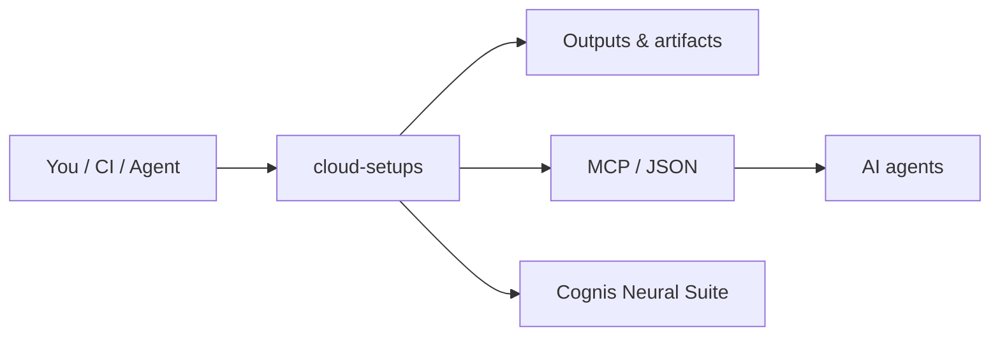

<div align="center">

# cloud-setups

### Batteries-included **Firebase · GCP · Azure** project setups — bootstrap, deploy, IaC, and emulators in one repo.

[](LICENSE)   

</div>

A merged, rebranded starter kit distilling the patterns from the popular cloud-starter ecosystem into
one place — copy a folder, set your IDs, deploy.

## Firebase  ·  [`firebase/`](firebase/)
`firebase.json`, Firestore rules + indexes, Cloud Functions, Hosting SPA rewrite, full **emulator suite**, `deploy.sh`.
```bash
cd firebase && bash deploy.sh   # emulators by default
```

## GCP  ·  [`gcp/`](gcp/)
`bootstrap.sh` (enable APIs + Artifact Registry), **Cloud Run** deploy, Terraform (`google_cloud_run_v2_service`).
```bash
PROJECT_ID=my-proj bash gcp/bootstrap.sh
```

## Azure  ·  [`azure/`](azure/)
`bootstrap.sh` (**Container Apps**), **Bicep** + Terraform (`azurerm`).
```bash
bash azure/bootstrap.sh
```

## Credits / prior art
In the spirit of `firebase/firebase-tools`, `GoogleCloudPlatform/cloud-run-samples`, `Azure-Samples/`,
and the `awesome-firebase` / `awesome-gcp` / `awesome-azure` lists — consolidated and rebranded. PRs to
add stacks (Supabase, Cloudflare, Fly.io) welcome.

## How it fits



**Explore the suite →** [🗂️ all tools](https://github.com/cognis-digital/cognis-neural-suite) · [⭐ awesome-cognis](https://github.com/cognis-digital/awesome-cognis) · [🔗 cognis-sources](https://github.com/cognis-digital/cognis-sources)

<a name="verification"></a>
## Verification


Every push is verified end-to-end. Latest audit (2026-06-13):

```text
tests        : 0 passed, 0 failed, 0 errored
compile      : all modules parse
cli          : n/a
package      : n/a
```

<details><summary>CLI surface (<code>--help</code>)</summary>

```text
(see --help)
```
</details>

Full machine-readable results: [`AUDIT.md`](AUDIT.md) · regenerate with `python -m cloud-setups --help` + `pytest -q`.

<div align="right"><a href="#top">↑ back to top</a></div>


## License
COCL v1.0 — see [LICENSE](LICENSE).
