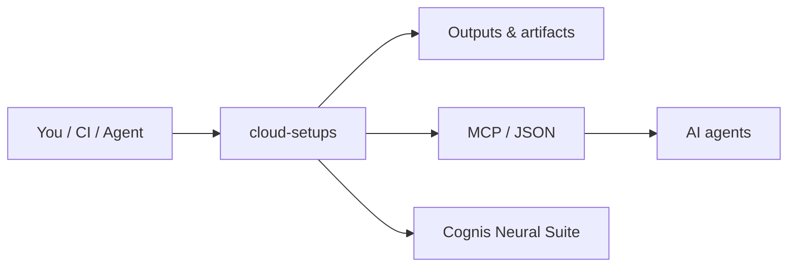

<div align="center">

# cloud-setups

### Batteries-included **Firebase · GCP · Azure** project setups — bootstrap, deploy, IaC, and emulators in one repo.

[](LICENSE)   

</div>

A merged, rebranded starter kit distilling the patterns from the popular cloud-starter ecosystem into
one place — copy a folder, set your IDs, deploy.

## Usage — step by step

1. **Get the repo** and pick the stack folder you need:
   ```bash
   git clone https://github.com/cognis-digital/cloud-setups && cd cloud-setups
   ```
   Each folder is self-contained: [`firebase/`](firebase/), [`gcp/`](gcp/), [`azure/`](azure/).
2. **Set your project IDs / credentials** for the target cloud (e.g. `PROJECT_ID`, `gcloud auth`, `az login`, `firebase login`).
3. **Bootstrap & deploy** the chosen stack with its bundled script:
   ```bash
   cd firebase && bash deploy.sh                 # Firebase (emulators by default)
   PROJECT_ID=my-proj bash gcp/bootstrap.sh      # GCP: enable APIs + Cloud Run
   bash azure/bootstrap.sh                       # Azure Container Apps
   ```
4. **Inspect the result** — Firebase deploy boots the full emulator suite locally; GCP/Azure print the deployed service URL. Hit it to confirm the deploy:
   ```bash
   curl -s "$SERVICE_URL"
   ```
5. **Manage as IaC in CI** — the GCP (Terraform `google_cloud_run_v2_service`) and Azure (Bicep + Terraform `azurerm`) definitions are committed, so a pipeline can `terraform apply` the same infra on every change.

## Firebase  ·  [`firebase/`](firebase/)
`firebase.json`, Firestore rules + indexes, Cloud Functions, Hosting SPA rewrite, full **emulator suite**, `deploy.sh`.
```bash
cd firebase && bash deploy.sh   # emulators by default
```

## GCP  ·  [`gcp/`](gcp/)
`bootstrap.sh` (enable APIs + Artifact Registry), **Cloud Run** deploy, Terraform (`google_cloud_run_v2_service`).
```bash
PROJECT_ID=my-proj bash gcp/bootstrap.sh
```

## Azure  ·  [`azure/`](azure/)
`bootstrap.sh` (**Container Apps**), **Bicep** + Terraform (`azurerm`).
```bash
bash azure/bootstrap.sh
```

## Credits / prior art
In the spirit of `firebase/firebase-tools`, `GoogleCloudPlatform/cloud-run-samples`, `Azure-Samples/`,
and the `awesome-firebase` / `awesome-gcp` / `awesome-azure` lists — consolidated and rebranded. PRs to
add stacks (Supabase, Cloudflare, Fly.io) welcome.

## How it fits



**Explore the suite →** [🗂️ all tools](https://github.com/cognis-digital/cognis-neural-suite) · [⭐ awesome-cognis](https://github.com/cognis-digital/awesome-cognis) · [🔗 cognis-sources](https://github.com/cognis-digital/cognis-sources)

## Interoperability

`{}` composes with the 300+ tool Cognis suite — JSON in/out and a shared
OpenAI-compatible `/v1` backbone. See **[INTEROP.md](INTEROP.md)** for the
suite map, composition patterns, and reference stacks.

## License
COCL v1.0 — see [LICENSE](LICENSE).
